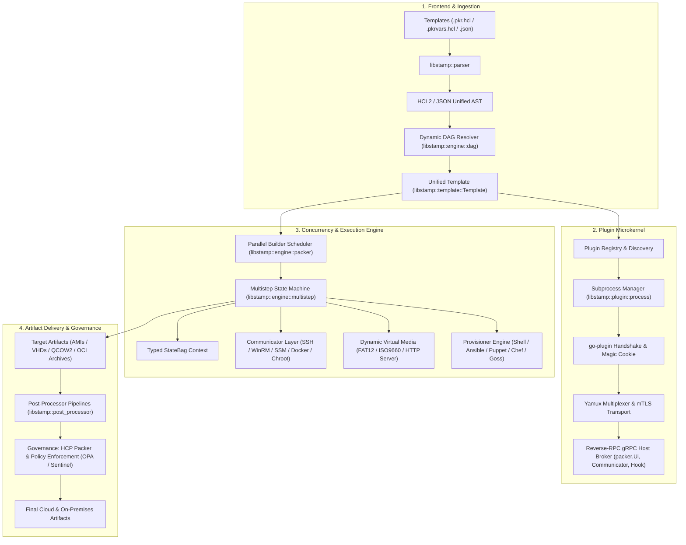
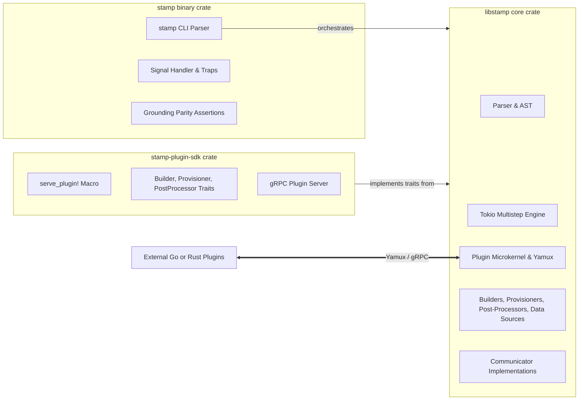
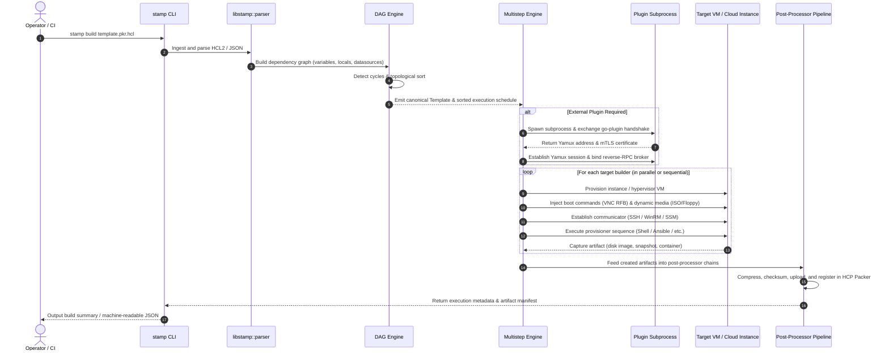
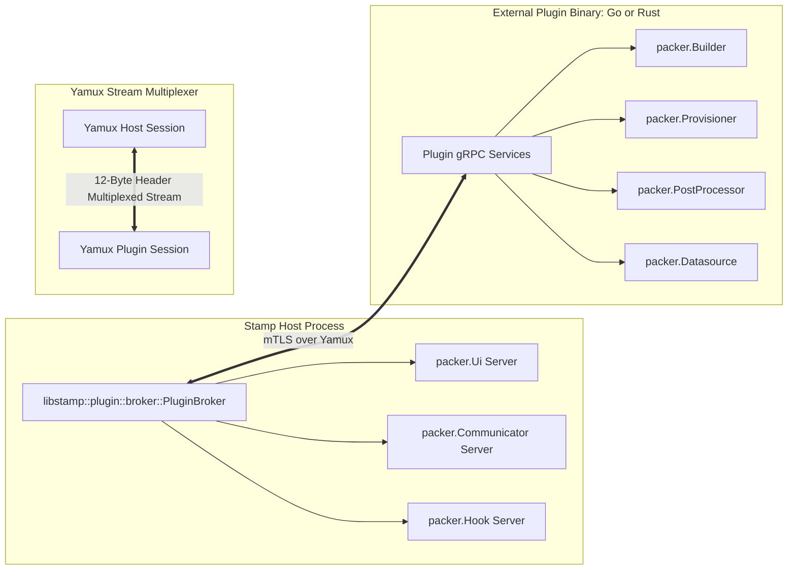
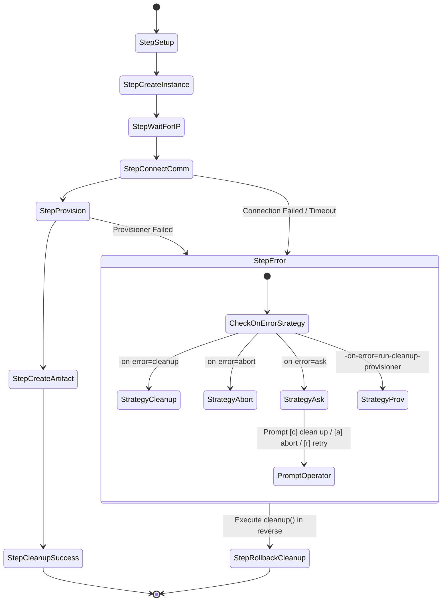
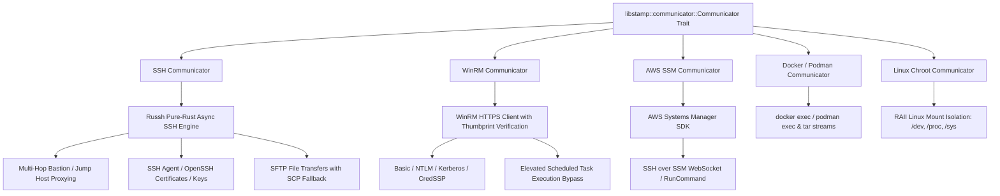
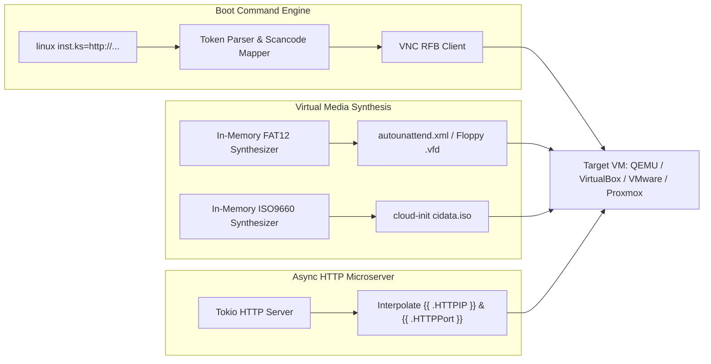
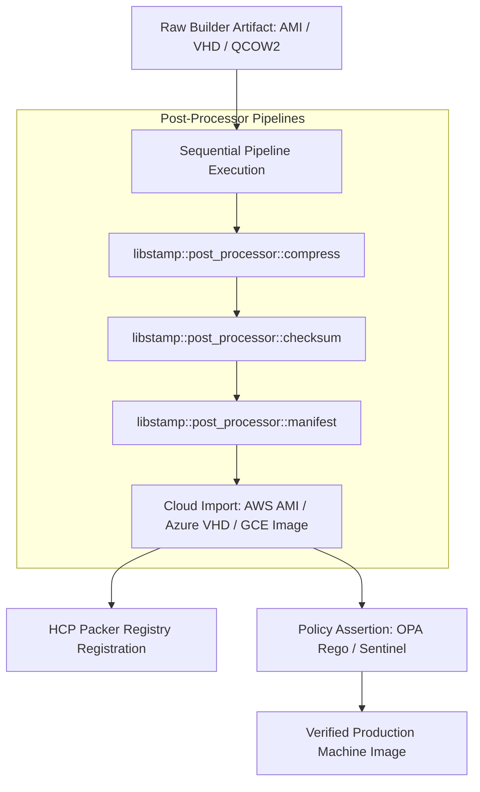

# Stamp Architectural Specification

Stamp is a high-performance, memory-safe, asynchronous machine image building framework and CLI orchestrator written in Rust. It delivers 100% functional and wire-level parity with **HashiCorp Packer** while adhering to uncompromising guarantees of zero unhandled panics, deterministic strongly-typed error handling, and 100% test and documentation coverage.

---

## Table of Contents

1. [Architectural Overview & Core Guarantees](#1-architectural-overview--core-guarantees)
2. [Workspace Decomposition](#2-workspace-decomposition)
3. [End-to-End Build Lifecycle](#3-end-to-end-build-lifecycle)
4. [Unified Template Model & Expression Engine](#4-unified-template-model--expression-engine)
   - [HCL2 & JSON Parsing Pipeline](#hcl2--json-parsing-pipeline)
   - [Directed Acyclic Graph (DAG) Resolution](#directed-acyclic-graph-dag-resolution)
   - [Template Function Evaluation](#template-function-evaluation)
5. [Plugin Microkernel & Wire Protocol Parity](#5-plugin-microkernel--wire-protocol-parity)
   - [HashiCorp go-plugin Handshake Protocol](#hashicorp-go-plugin-handshake-protocol)
   - [Yamux Connection Multiplexing](#yamux-connection-multiplexing)
   - [Reverse-RPC Host Broker](#reverse-rpc-host-broker)
   - [Dynamic Schema Negotiation](#dynamic-schema-negotiation)
6. [Multistep Engine & Execution State Machine](#6-multistep-engine--execution-state-machine)
   - [StateBag & Context Passing](#statebag--context-passing)
   - [Interactive Debug Pausing & Stepping](#interactive-debug-pausing--stepping)
   - [Fault Tolerance & Error Recovery Strategies](#fault-tolerance--error-recovery-strategies)
   - [Two-Stage Signal Handling](#two-stage-signal-handling)
7. [Resilient Multi-Protocol Communicator Subsystem](#7-resilient-multi-protocol-communicator-subsystem)
   - [SSH Transport & Bastion Tunneling](#ssh-transport--bastion-tunneling)
   - [WinRM Transport & Windows Scheduled Task Elevation](#winrm-transport--windows-scheduled-task-elevation)
   - [AWS SSM Session Manager Tunneling](#aws-ssm-session-manager-tunneling)
   - [Container & Chroot Sandboxes](#container--chroot-sandboxes)
8. [Hypervisor Automation & Dynamic Guest Media](#8-hypervisor-automation--dynamic-guest-media)
   - [Tokenized Keystroke Injection & VNC RFB](#tokenized-keystroke-injection--vnc-rfb)
   - [In-Memory Virtual Media Synthesis](#in-memory-virtual-media-synthesis)
   - [Asynchronous Embedded HTTP Server](#asynchronous-embedded-http-server)
9. [Artifact Delivery & Post-Processor Pipelines](#9-artifact-delivery--post-processor-pipelines)
   - [Nested Pipeline Processing](#nested-pipeline-processing)
   - [Cloud Import and Conversion Engine](#cloud-import-and-conversion-engine)
   - [HCP Packer Lineage & Revocation Tracking](#hcp-packer-lineage--revocation-tracking)
   - [Policy Enforcement (OPA Rego & Sentinel)](#policy-enforcement-opa-rego--sentinel)
10. [Strict Quality, Typing & Zero-Panic Safety Mandates](#10-strict-quality-typing--zero-panic-safety-mandates)

---

## 1. Architectural Overview & Core Guarantees

Stamp solves the fragility, runtime panics, and untyped error propagation common in legacy DevOps toolchains. By leveraging Rust's ownership model, strict compile-time checks, and Tokio's asynchronous runtime, Stamp operates as both a standalone CLI binary and an embeddable systems library.



### Foundational Architectural Principles
- **Absolute Zero Panics:** All execution paths strictly forbid unhandled panics (`#![deny(clippy::unwrap_used, clippy::expect_used)]`). Failures are handled explicitly through typed return variants.
- **Unified Deterministic Error Tree:** `libstamp::error::StampError` provides a strongly typed, exhaustive error enumeration using `derive_more`. The system never uses `anyhow` or untyped dynamic boxed errors.
- **Complete Parity with Upstream Packer:** Wire-level protocol compatibility ensures that any upstream Go-based `packer-plugin-*` binary operates identically under Stamp, and any valid HCL2 or pre-BSL JSON template executes without modification.

---

## 2. Workspace Decomposition

Stamp is structured as an interconnected Cargo workspace separating user interaction, core business logic, and third-party extension points:



- **`stamp`**: The command-line orchestration binary built on `clap`. Responsible for command routing, environment variable parsing (`PKR_VAR_*`, `PACKER_*`), shell completion emission, terminal TTY formatting, interactive prompts, and two-stage signal management.
- **`libstamp`**: The headless core engine. Exposes high-level async building APIs (`build_concurrently`), the multistep state-machine runner, DAG resolution, communicators, and dynamic media generators.
- **`stamp-plugin-sdk`**: A high-level SDK providing the `serve_plugin!` macro and gRPC service adapters, allowing third-party developers to author out-of-process plugins in native Rust without interacting with raw protocol buffers.

---

## 3. End-to-End Build Lifecycle

When an operator executes `stamp build template.pkr.hcl`, the system executes through distinct phases with well-defined state boundaries:



---

## 4. Unified Template Model & Expression Engine

All HCL2 parsing, AST analysis, dynamic block expansions, expression evaluations, standard library functions, and canonical formatting are delegated directly to [**`hashicorp-configuration-language-rs`**](https://github.com/SamuelMarks/hashicorp-configuration-language-rs).

### Delegation to `hashicorp-configuration-language-rs`
Rather than maintaining an ad-hoc HCL parser, Stamp relies on the dedicated `hashicorp-configuration-language-rs` crate across every tier of template processing:
- **Lexical Analysis & AST Parsing (`parse::parser::Parser`):** Parses raw `.pkr.hcl` source text into typed HCL2 AST structures (`Block`, `Body`, `Attribute`, `Expression`).
- **Canonical CST Formatting (`cst::format::format_str`):** Powers the `stamp fmt` command, producing canonical formatting and alignment identical to upstream HashiCorp Packer and Terraform.
- **Dynamic Block Expansion (`eval::dynblock::expand_dynamic_blocks`):** Natively expands HCL2 `dynamic` blocks (e.g. iterating over provisioner configurations or disk attachments).
- **Expression Evaluation & Scoping (`eval::context::Context`, `eval::evaluator::Evaluator`):** Evaluates HCL2 traversals, ternary conditionals, splat expressions, for-expressions, and arithmetic operations against scoped evaluation contexts.
- **Standard Function Library (`eval::stdlib::all_functions`):** Direct injection of the standard HCL functions library (`upper()`, `lower()`, `split()`, `join()`, `replace()`, `coalesce()`, `file()`, `fileexists()`, `base64encode()`, `jsonencode()`, `bcrypt()`, `timestamp()`, `env()`, etc.).
- **Typed Value & Number System (`types::{Type, Value, ValueData}`, `number::Number`):** Provides exact precision numeric and structured type modeling without loss of fidelity.
- **Typed Error Propagation:** Wraps `hashicorp_configuration_language_rs::error::HclError` directly into `StampError::Hcl`.

### HCL2 & JSON Parsing Pipeline
Stamp ingests both modern HCL2 (`.pkr.hcl`, `.pkrvars.hcl`) and historical JSON templates:
- **Direct AST Parsing:** Employs `hashicorp-configuration-language-rs` to parse HCL2 syntax directly into structured syntax trees without intermediary JSON transformation.
- **Unified Intermediate Representation (`libstamp::template::Template`):** Legacy JSON and HCL2 templates lower into the same strongly typed `Template` struct, featuring dedicated blocks for `variables`, `locals`, `builders`, `provisioners`, `post_processors`, `data_sources`, `tests`, and `builds`.

### Directed Acyclic Graph (DAG) Resolution
Template components often depend on variables, locals, or dynamic data source results. Stamp evaluates these through a dependency graph (`libstamp::engine::dag`):
- **Node Classification:** Graph nodes are typed as `EvalNode::Variable`, `EvalNode::Local`, `EvalNode::DataSource`, or `EvalNode::Builder`.
- **Dependency Extraction:** Traversal operators extract cross-references (e.g., `local.app_name` references `var.environment`).
- **Cycle Detection:** Depth-first topological sorting identifies and rejects cyclic references at validation time, raising a typed `StampError::CircularDependency`.

### Template Function Evaluation
Stamp provides seamless access to template functions directly via `hashicorp-configuration-language-rs::eval::stdlib`:
- String and collection transformers: `upper()`, `lower()`, `split()`, `join()`, `replace()`, `coalesce()`.
- Filesystem and encoding utilities: `file()`, `fileexists()`, `base64encode()`, `base64decode()`, `jsonencode()`, `jsondecode()`.
- Cryptography & System: `bcrypt()`, `sha256()`, `timestamp()`, `env()`.

---

## 5. Plugin Microkernel & Wire Protocol Parity

Stamp implements the HashiCorp `go-plugin` specification to provide seamless out-of-process plugin execution.



### HashiCorp go-plugin Handshake Protocol
1. **Subprocess Spawning (`libstamp::plugin::process`):** Stamp launches the plugin executable with magic cookie validation environment variables:
   - `PACKER_PLUGIN_MAGIC_COOKIE="Hello"`
2. **Stdout Handshake Negotiation:** The plugin emits a single-line handshake string:
   `CORE_PROTOCOL_VERSION|APP_PROTOCOL_VERSION|NETWORK_TYPE|ADDRESS|PROTOCOL`
   *(e.g., `1|5|tcp|127.0.0.1:49152|grpc` or `1|5|unix|/tmp/packer-plugin.sock|grpc`)*.
3. **Transport Security:** If configured, ephemeral mTLS certificates are generated dynamically via `rcgen` and exchanged to enforce mutual TLS encryption across the boundary.

### Yamux Connection Multiplexing
Stamp includes a pure-Rust implementation of the **Yamux** stream multiplexing protocol:
- **12-Byte Header Framing:** Encodes version, frame type (Data, WindowUpdate, Ping, GoAway), flags (SYN, ACK, FIN, RST), Stream ID, and payload length.
- **Credit-Based Flow Control:** Tracks per-stream receive windows (default 256 KB) and dispatches `WindowUpdate` frames when windows drain.
- **Bi-Directional Streams:** Allows the host to initiate gRPC calls to the plugin while concurrently allowing the plugin to call back into host services over a single TCP or Unix Domain Socket connection.

### Reverse-RPC Host Broker
When a plugin executes, it frequently requires host resources. Stamp exposes reverse-RPC gRPC endpoints through its internal `PluginBroker`:
- **`packer.Ui`**: Relays log lines, status updates, interactive operator prompts, and machine-readable CSV/JSON events.
- **`packer.Communicator`**: Streams command stdin/stdout/stderr and file byte chunks between the external plugin and the host's active communicator.
- **`packer.Hook`**: Invokes host provisioners during builder execution lifecycle events.

### Dynamic Schema Negotiation
Before initiating builds, Stamp queries remote plugins using the `packer.Schema` gRPC service. The returned schema validates template parameters, catches typos, and verifies data types prior to any infrastructure provisioning.

---

## 6. Multistep Engine & Execution State Machine

Builder execution is driven by a deterministic state-machine runner (`libstamp::engine::multistep`):



### StateBag & Context Passing
Steps communicate state using a thread-safe, downcasting container (`StateBag`):
- Uses `std::any::Any` with strongly-typed safe accessors.
- Key properties include `instance_ip`, `ssh_port`, `artifact_id`, `conn_info`, `ssh_public_key`, `ssh_private_key`, and `packer_run_uuid`.
- Provides an execution history trace (`step_execution_history`) that tracks the exact order of executed steps for deterministic reverse cleanup.

### Interactive Debug Pausing & Stepping
When `-debug` is passed:
- The runner pauses execution before and after every lifecycle step.
- Operator input is captured via terminal TTY (`Press enter to continue...`).
- The running guest instance and SSH channels remain fully open, enabling live inspection and debugging.

### Fault Tolerance & Error Recovery Strategies
Configured via `-on-error=<strategy>`:
- **`cleanup` (default):** Automatically iterates backward through `step_execution_history`, executing each step's `cleanup()` handler to terminate cloud instances, remove disks, and unmount filesystems.
- **`abort`:** Immediately halts execution without invoking cleanup, preserving active cloud resources for forensic investigation.
- **`ask`:** Pauses execution upon error and interactively prompts the operator:
  - `[c] clean up`: Triggers reverse step cleanup and terminates.
  - `[a] abort`: Exits immediately, leaving the infrastructure running.
  - `[r] retry`: Re-executes the failed step.
- **`run-cleanup-provisioner`:** Executes provisioners defined with `error-cleanup = true` before commencing teardown.

### Two-Stage Signal Handling
Stamp traps OS signals (`SIGINT`, `SIGTERM`) asynchronously:
- **First Signal:** Intercepts cancellation, sets the `cancel_rx` watch channel on `StateBag`, and triggers graceful step rollbacks.
- **Second Signal:** Forces immediate abort and process termination (`std::process::exit(1)`).

---

## 7. Resilient Multi-Protocol Communicator Subsystem

Communicators abstract guest OS command execution and filesystem interaction:



### SSH Transport & Bastion Tunneling
- Implemented using pure-Rust `russh`.
- **Bastion / Jump Hosts:** Supports multi-hop jump hosts where connections tunnel transparently through intermediate bastions.
- **Authentication Matrix:** Private keys, password authentication, agent forwarding (`SSH_AUTH_SOCK` and Windows named pipes), and OpenSSH cryptographic certificate authentication.
- **File Transfers:** High-speed SFTP transfers with automatic, transparent fallback to SCP for minimal guest environments.

### WinRM Transport & Windows Scheduled Task Elevation
- HTTP and HTTPS transport with custom CA validation and thumbprint pin-checking.
- Authentication support for Basic, NTLM, Kerberos (GSSAPI/SSPI), SPNEGO, and CredSSP.
- **UAC Bypass Elevation:** To circumvent Windows User Account Control (UAC) token stripping over remote PowerShell sessions, Stamp can wrap commands in ephemeral Windows Scheduled Tasks running under `NT AUTHORITY\SYSTEM`.

### AWS SSM Session Manager Tunneling
- Tunnels SSH or remote commands directly through AWS Systems Manager endpoints.
- Requires zero open inbound firewall ports and eliminates public IPv4 address requirements on target instances.

### Container & Chroot Sandboxes
- **Containers:** Native streaming of `docker exec` and `podman exec`, paired with streaming tar-archive copies (`docker cp`).
- **Chroot:** Safe Linux mount namespace isolation managing `/dev`, `/proc`, `/sys`, and `/etc/resolv.conf`, guaranteed to unmount via RAII drop guards upon completion or abort.

---

## 8. Hypervisor Automation & Dynamic Guest Media

Stamp automates bare-metal and hypervisor guest OS installations from raw boot media:



### Tokenized Keystroke Injection & VNC RFB
- Parses boot command syntax containing ASCII text, navigation sequences (`<enter>`, `<tab>`, `<esc>`, `<backspace>`, `<f1>`-`<f12>`), modifier keys (`<leftShiftOn>`, `<leftCtrlOn>`), and calibrated pauses (`<waitX[s|m|ms]>`).
- Drives an integrated VNC RFB client that transmits raw keyboard scancodes directly into virtual machine framebuffers (QEMU, VirtualBox, VMware, Proxmox).

### In-Memory Virtual Media Synthesis
- Generates FAT12 floppy disk images (`.vfd`, `.img`) entirely in memory without requiring host utilities like `mkfs.vfat` or root permissions.
- Synthesizes ISO9660 CD-ROM images dynamically on the fly to supply `cloud-init` configuration files (`meta-data`, `user-data`), Kickstarts, or Windows answer files (`autounattend.xml`).

### Asynchronous Embedded HTTP Server
- Starts an in-process Tokio HTTP server bound to an ephemeral port.
- Serves kickstart, preseed, or cloud-init answer files directly to installing guest OSes.
- Interpolates host network metadata dynamically into boot commands via `{{ .HTTPIP }}` and `{{ .HTTPPort }}`.

---

## 9. Artifact Delivery & Post-Processor Pipelines



### Nested Pipeline Processing
Post-processors execute linearly or via nested pipeline definitions:
```hcl
post-processors {
  pipeline {
    post-processor "compress" { output = "disk.qcow2.gz" }
    post-processor "checksum" { checksum_types = ["sha256"] }
    post-processor "manifest" { output = "manifest.json" }
  }
}
```
Intermediate artifacts are passed forward and automatically cleaned up once subsequent processing steps complete.

### Cloud Import and Conversion Engine
Converts raw disk images into cloud-native compute images:
- Direct upload and registration for AWS AMIs (`amazon-import`, `amazon-ami-management`).
- Google Compute Engine disk image imports (`googlecompute-import`).
- Azure Managed Images from VHD storage blobs (`azure-arm`).
- VMware vSphere VM Templates (`vsphere-template`).

### HCP Packer Lineage & Revocation Tracking
- Automatically authenticates against the HashiCorp Cloud Platform (HCP) using OAuth2 service credentials.
- Registers iterations, assigns deployment channels (`staging`, `production`), tracks Git commit lineage, and registers build artifacts.
- Verifies base image revocation status prior to build execution, failing builds if upstream parent images have been deprecated or revoked.

### Policy Enforcement (OPA Rego & Sentinel)
- **Open Policy Agent (OPA):** Ingests template configuration and artifact metadata as JSON, evaluating Rego policies to verify compliance (e.g., encryption settings, authorized base AMIs).
- **HashiCorp Sentinel:** Evaluates policy logic against template ASTs before provisioning starts.
- Can be bypassed using `--skip-enforcement` for emergency maintenance builds.

---

## 10. Strict Quality, Typing & Zero-Panic Safety Mandates

Stamp enforces immutable code quality and reliability invariants:

1. **Zero Panics (`unwrap_used`, `expect_used`):**
   ```rust
   #![deny(clippy::unwrap_used, clippy::expect_used)]
   ```
   Every potential `None` or `Err` must be explicitly handled, propagated using `?`, or safely mapped into a `StampError`.

2. **Unified Strongly Typed Errors (`libstamp::error::StampError`):**
   Centralizes all subsystem failure modes:
   ```rust
   #[derive(Debug, Display, From)]
   pub enum StampError {
       Io(std::io::Error),
       Json(serde_json::Error),
       Hcl(hashicorp_configuration_language_rs::error::HclError),
       Builder(String),
       Provisioner(String),
       PostProcessor(String),
       Communicator(String),
       CircularDependency(String),
       PluginHandshake(String),
       PluginCrashed { binary: String, exit_code: Option<i32>, stderr: String },
       ChecksumMismatch { expected: String, actual: String },
       PolicyViolation { policy: String, details: String },
       // ...
   }
   ```

3. **100% Rustdoc & Test Coverage:**
   The workspace enforces `#![deny(missing_docs)]` and `#![deny(clippy::missing_docs_in_private_items)]`. Public and private items alike require comprehensive doc comments and assertions.

4. **Continuous Grounding Verification:**
   The `stamp/src/bin/grounding.rs` binary compares Stamp's internal schemas against official HashiCorp Packer reference schemas in CI, ensuring 100% compatibility and schema parity.
