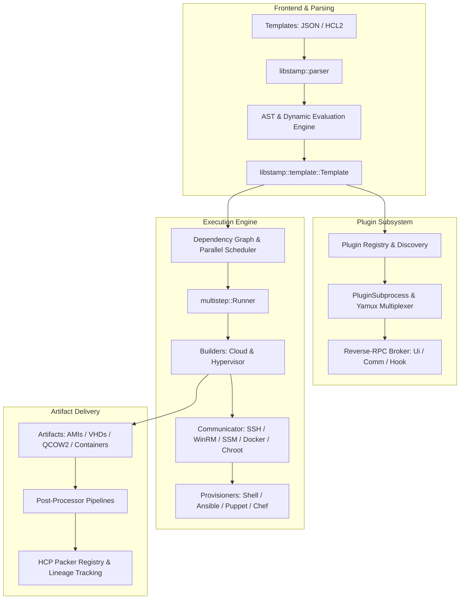

# Stamp Architectural Specification

Stamp is a high-performance, memory-safe, asynchronous machine image building framework and CLI orchestrator written in Rust. It achieves 100% functional and wire-level parity with **HashiCorp Packer** while maintaining strict zero-panic guarantees and complete test and documentation coverage.

---

## High-Level Architecture Overview

---

## 1. Unified Template Model & HCL2 Integration

- **Sister Repository Integration:** Stamp directly integrates with `hashicorp-configuration-language-rs` for HCL2 AST parsing, semantic evaluation, and standard functions.
- **Unified Representation (`libstamp::template::Template`):** Legacy JSON and modern HCL2 templates parse into a unified, strongly-typed internal data structure without intermediate untyped dictionaries.
- **Dynamic Variable Scoping:** Variables, locals, data sources, and environment variables (`PKR_VAR_*`) are resolved through a directed acyclic graph (DAG) ensuring cycle-free, deterministic evaluation.

---

## 2. Plugin Microkernel & Wire Protocol

Stamp provides full bidirectional wire-level compatibility with external `packer-plugin-*` Go binaries:

### Handshake & Process Lifecycle (`libstamp::plugin::process`)
- Implements the HashiCorp `go-plugin` handshake:
  `CORE_PROTOCOL_VERSION|APP_PROTOCOL_VERSION|NETWORK_TYPE|ADDRESS|PROTOCOL`
- Enforces magic cookie validation (`PACKER_PLUGIN_MAGIC_COOKIE`).
- Supports Unix domain sockets on macOS/Linux and loopback TCP on Windows/Unix with bounded port allocation (`PACKER_PLUGIN_MIN_PORT`, `PACKER_PLUGIN_MAX_PORT`).
- Supports mutual TLS (mTLS) for encrypted inter-process gRPC communication.
- Tracks process health and captures stderr on crash, propagating typed `StampError::PluginCrashed`.

### Connection Multiplexing (`libstamp::plugin::yamux`)
- Custom Rust implementation of HashiCorp `yamux` specification.
- 12-byte header framing with credit-based flow control windows (initial 256 KB window).
- Multiplexes bidirectional logical streams over a single byte stream.
- Supports SYN/ACK stream initialization, FIN half-close, RST aborts, and periodic keepalive ping frames.

### Reverse-RPC Host Broker (`libstamp::plugin::broker`)
- Host-side gRPC services demultiplexed over the plugin connection:
  - `packer.Ui`: Streams `Say`, `Message`, `Error`, `Ask`, and machine-readable `UiEvent`.
  - `packer.Communicator`: Bi-directional streaming for guest command execution (`Execute`), file uploads, and downloads.
  - `packer.Hook`: Dynamic lifecycle hooks allowing external builders to trigger host-managed provisioners.

### Dynamic Schema Negotiation (`libstamp::engine::schema`)
- Implements `packer.Schema` gRPC service for querying external plugin schemas.
- Validates template blocks against remote plugin schemas prior to build initiation.

---

## 3. Multistep Engine & Interactive Execution

Build execution is driven by the state-machine runner in `libstamp::engine::multistep`:

- **State Bag:** Strongly-typed thread-safe key-value store carrying state between execution steps.
- **Interactive Step Pausing (`-debug`):** Halts before and after each step, prompting the developer on the terminal TTY while maintaining running guest VM state.
- **Configurable Error Strategies (`-on-error`):**
  - `cleanup`: Executes backward cleanup handlers for all executed steps.
  - `abort`: Halts immediately without cleaning up resources, leaving target instances intact for inspection.
  - `ask`: Interactively prompts user to clean up, abort, or retry the failed step.
  - `run-cleanup-provisioner`: Invokes provisioners configured with `error-cleanup = true` before teardown.

---

## 4. Resilient Communicator Layer

Communicators provide the communication channel into target guest systems:

- **SSH (`libstamp::communicator::ssh`):**
  - Bastion / Jump Host forwarding with chained proxies.
  - SSH Agent authentication via `SSH_AUTH_SOCK` and Windows named pipes.
  - OpenSSH certificate authentication.
  - PTY allocation and environment variable injection.
  - SFTP with automatic fallback to SCP.
- **WinRM (`libstamp::communicator::winrm`):**
  - HTTPS transport with thumbprint verification and custom CA certificates.
  - Multi-scheme authentication: Basic, NTLM, Kerberos (GSSAPI/SSPI), SPNEGO, CredSSP.
  - Elevated command execution via Windows Scheduled Tasks to bypass UAC limits.
  - Base64 chunked file transfers with in-guest .NET decompression.
- **AWS SSM Session Manager (`libstamp::communicator::ssm`):**
  - SSH port tunneling via AWS Systems Manager Session Manager (no inbound ports or public IPs required).
  - Direct execution via `AWS-RunShellScript` and `AWS-RunPowerShellScript`.
  - S3-assisted high-speed file transfers.
- **Container Communicators (`libstamp::communicator::docker`, `podman`):**
  - Native streaming of `docker exec` and `podman exec` with user, directory, and env controls.
  - High-throughput tar-stream archive copy (`docker cp`).
- **Chroot Communicator (`libstamp::communicator::chroot`):**
  - Safe Linux mount management (`/dev`, `/proc`, `/sys`, `/etc/resolv.conf`) with RAII-guaranteed unmount.

---

## 5. Hypervisor & Cloud Automation

### Boot Command & Keystroke Injection
- Universal token parser supporting ASCII, special keys (`<enter>`, `<tab>`, `<esc>`, `<f1>`-`<f12>`), modifiers (`<leftShiftOn>`, `<leftCtrlOn>`), and timing controls (`<waitX>`).
- VNC RFB protocol client for typing scan codes directly into virtual machine framebuffers (QEMU, VirtualBox, VMware, Proxmox).

### Dynamic Guest Media & HTTP Server
- Dynamic in-memory FAT12 floppy image (.vfd/.img) generation.
- Dynamic in-memory ISO9660 CD-ROM generation for `cloud-init` (`cidata`) and kickstarts.
- Built-in asynchronous HTTP server serving files to guests with dynamic port allocation and template variable interpolation (`{{ .HTTPIP }}`, `{{ .HTTPPort }}`).

### Cloud & Hypervisor Builders
Native implementations for AWS, Azure, Google Cloud, VMware, vSphere, QEMU, Proxmox, Docker, Podman, and 20+ additional platforms.

---

## 6. Post-Processor Pipelines & HCP Packer

- **Nested Pipelines:** Chained execution of sequential post-processors (`[ [ "compress", "manifest" ], "vagrant" ]`) with intermediate artifact passing and cleanup.
- **Core Processors:** `manifest` (JSON metadata), `compress` (gzip, bzip2, xz, zip), `checksum` (MD5, SHA-1, SHA-256, SHA-512), `vagrant` / `vagrant-cloud`.
- **Cloud Import:** Direct VMDK/RAW to AWS AMI, GCE image, Azure Managed Image, and vSphere VM Template import.
- **HCP Packer Registry:** Automated OAuth2 iteration tracking, channel deployment, build metadata reporting, and golden image revocation checking.
- **Policy Enforcement:** Sentinel and Open Policy Agent (OPA/Rego) evaluation hooks with audit logging and `--skip-enforcement` overrides.

---

## 7. Strict Quality & Safety Mandates

All components in Stamp adhere to immutable engineering standards:
- **Zero Unhandled Panics:** Denied `unwrap()` and `expect()` via `#![deny(clippy::unwrap_used, clippy::expect_used)]`.
- **Unified Strongly-Typed Errors:** Single root `StampError` enum powered by `derive_more`.
- **100% Rustdoc Coverage:** `#![deny(missing_docs)]` and `#![deny(clippy::missing_docs_in_private_items)]`.
- **Zero Clippy Warnings:** Clean under `-D warnings -D clippy::pedantic`.
- **Continuous Grounding Verification:** `stamp/src/bin/grounding.rs` verifies parity against official HashiCorp Packer schemas in CI.
