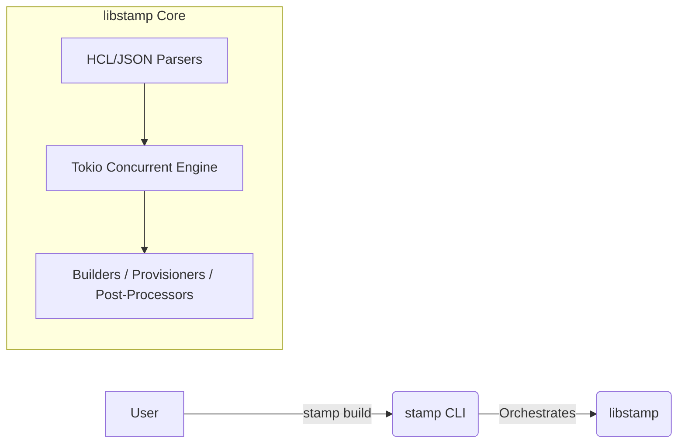

Stamp (Packer reimplementation; open-source)
============================================

**Stamp** is a fast, fiercely reliable, and strongly-typed Rust replication of the core functionalities found in **HashiCorp Packer**. It is designed to be 100% compatible with [pre-BSL](https://www.hashicorp.com/blog/hashicorp-adopts-business-source-license) Packer templates (JSON and HCL2).

> **Looking for a Vagrant alternative?**
> Check out [**Migratory**](https://github.com/SamuelMarks/migratory), our sister project that provides a 100% compatible, Rust-based replication of HashiCorp Vagrant.

## The Mission

The modern infrastructure-as-code landscape is often fraught with dynamic typing, opaque errors, and sprawling toolchains. Stamp rebuilds the foundational mechanics of machine image building using Rust's unparalleled safety guarantees.

### Key Tenets
1. **Safety First:** Guaranteed `0` unhandled panics. Stamp enforces a strict `deny` policy on the usage of `unwrap()` and `expect()`.
2. **Strong Typing:** Domains are modeled exactly. A port is a `Port(u16)`, not a generic integer. Memory sizes are strongly typed.
3. **Deterministic Error Handling:** Stamp does not use `anyhow` or loose boxed errors. All library failures fold into a strictly-typed, unified `StampError` enumeration (powered by `derive_more`), ensuring that the system's exact failure modes are known and pattern-matchable.
4. **Rigorous Quality Standards:**
   - `100%` test coverage across all lines, branches, and functions.
   - `100%` rustdoc coverage across the entire codebase.
   - Run under the strictest lint levels (e.g., `clippy::pedantic`).

## Core Features

- **HCL2 & JSON Parsing:** First-class ingestion of standard Packer templates using `hcl-rs` and `serde`.
- **Concurrent Build Engine:** A reliable, parallel executor powered by `tokio`, capable of running massive image builds safely.
- **20+ Scaffolded Builders:** First-class support for Amazon EC2/EBS, Azure ARM, Google Compute, Docker, QEMU, VirtualBox, Proxmox, Hetzner, and more.
- **15+ Provisioners:** Seamless configuration management integrations for Shell, Ansible, Chef, Puppet, and Salt.
- **Unified Communicator Layer:** Safely typed and completely abstracted SSH, WinRM, and Mock execution channels.

## Project Layout

Stamp is delivered as a highly modular Cargo workspace containing two primary components:

* **`libstamp`**: The core library. Contains all parsers, state machines, engines, and trait definitions. It is intentionally decoupled from the CLI interface so that it can be safely embedded into other Rust orchestrators or automation tools.
* **`stamp`**: The `clap`-driven CLI binary presenting the user interface (e.g., `stamp build`). It acts as a lightweight wrapper that orchestrates `libstamp`.

## Documentation

Dive deeper into how Stamp works under the hood and how you can use it:

- [Architecture Guide](ARCHITECTURE.md) - Learn about traits, concurrency, and error handling.
- [Usage Guide](USAGE.md) - Learn how to run Stamp from the CLI or embed it in your Rust applications.

---

## License

Licensed under any of

- Apache License, Version 2.0 ([LICENSE-APACHE](LICENSE-APACHE) or
  <https://apache.org/licenses/LICENSE-2.0>)
- Creative Commons CC0, Version 1.0 [LICENSE-CC0](LICENSE-CC0) or <http://creativecommons.org/publicdomain/zero/1.0/>)
- MIT license ([LICENSE-MIT](LICENSE-MIT) or <https://opensource.org/licenses/MIT>)

at your option.

### Contribution

Unless you explicitly state otherwise, any contribution intentionally submitted
for inclusion in the work by you, as defined in the Apache-2.0 license, shall be
licensed as above, without any additional terms or conditions.
