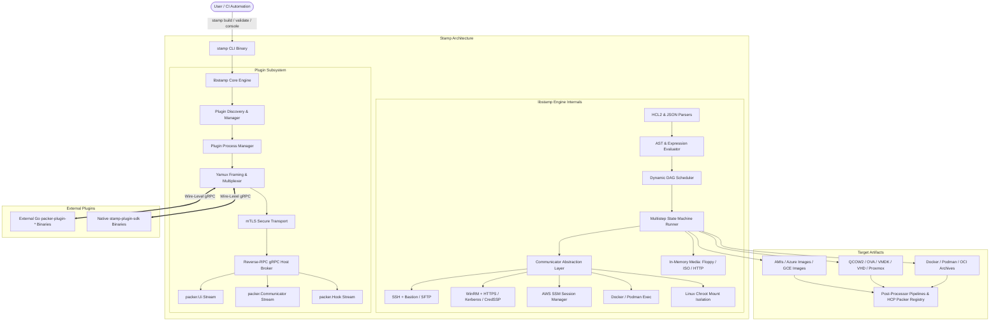

Stamp (Packer reimplementation; open-source)
============================================

[](https://opensource.org/licenses/Apache-2.0)
[](#)
[](#)
[](https://github.com/SamuelMarks/stamp/actions)

**Stamp** is a fast, fiercely reliable, and strongly-typed Rust replication of the core functionalities found in the original HashiCorp project, [**HashiCorp Packer**](https://github.com/hashicorp/packer). It is designed to be 100% compatible with pre-BSL Packer templates (both modern HCL2 and legacy JSON) while maintaining wire-level compatibility with existing HashiCorp `packer-plugin-*` external binaries. On August 10, 2023, HashiCorp announced that future releases of its products would transition from the Mozilla Public License v2.0 (MPL 2.0) to the Business Source License v1.1 (BSL 1.1) [[1]](#references--citations). Stamp was built to ensure that modern machine image orchestration remains free, open-source, and unencumbered by source-available licensing restrictions.

> **Looking for a Vagrant alternative?**
> Check out [**SamuelMarks/migratory**](https://github.com/SamuelMarks/migratory), our sister project that provides a 100% compatible, Rust-based replication of HashiCorp Vagrant.
>
> **HCL2 Engine Delegation:**
> All HCL2 lexical parsing, AST/CST processing, canonical formatting (`stamp fmt`), dynamic block expansion (`dynamic`), standard library functions, and expression evaluation are delegated directly to our sister project [**`hashicorp-configuration-language-rs`** (`hashicorp-configuration-rs`)](https://github.com/SamuelMarks/hashicorp-configuration-language-rs).

---

## Table of Contents

- [The Mission & Core Tenets](#the-mission--core-tenets)
- [System Architecture](#system-architecture)
  - [Workspace Crates](#workspace-crates)
  - [Architectural Topology](#architectural-topology)
- [Core Capabilities](#core-capabilities)
  - [Unified Template Engine & Dynamic DAG](#unified-template-engine--dynamic-dag)
  - [Bidirectional Plugin Microkernel & Reverse-RPC](#bidirectional-plugin-microkernel--reverse-rpc)
  - [Resilient Multi-Protocol Communicator Layer](#resilient-multi-protocol-communicator-layer)
  - [Hypervisor Automation & Dynamic Media](#hypervisor-automation--dynamic-media)
  - [Enterprise Governance & HCP Packer](#enterprise-governance--hcp-packer)
- [Ecosystem Support Matrix](#ecosystem-support-matrix)
  - [Builders](#builders-40)
  - [Provisioners](#provisioners-20)
  - [Post-Processors](#post-processors-25)
  - [Data Sources](#data-sources-15)
- [Installation & Getting Started](#installation--getting-started)
  - [Building from Source](#building-from-source)
  - [Basic Build Workflow](#basic-build-workflow)
- [CLI Reference](#cli-reference)
- [Interactive Debugging & Error Handling](#interactive-debugging--error-handling)
- [Extending Stamp](#extending-stamp)
  - [Writing Plugins with `stamp-plugin-sdk`](#writing-plugins-with-stamp-plugin-sdk)
  - [Embedding `libstamp` in Rust Applications](#embedding-libstamp-in-rust-applications)
- [Quality Assurance & Auditing](#quality-assurance--auditing)
- [Documentation](#documentation)
- [References & Citations](#references--citations)
- [License](#license)

---

## The Mission & Core Tenets

The modern infrastructure-as-code landscape is often fraught with dynamic typing, opaque runtime errors, and sprawling toolchains. Stamp rebuilds machine image orchestration from first principles using Rust's memory safety, fearlessly parallel concurrency, and zero-cost abstractions.

### Key Guarantees
1. **Safety First (Zero Panics):** Guaranteed `0` unhandled panics. Stamp strictly denies `unwrap()` and `expect()` via `#![deny(clippy::unwrap_used, clippy::expect_used)]`.
2. **Strong Domain Modeling:** Concepts are strongly typed rather than modeled as loose strings or integers. A port is a `Port(u16)`, memory allocations use strong dimension types, and states transition through compile-time state machines.
3. **Deterministic Error Handling:** Stamp rejects loose boxed errors and unstructured dynamic error types. All library failures fold into a strictly-typed, unified `StampError` enumeration (powered by `derive_more`), enabling exact, exhaustive pattern matching across failure modes.
4. **Rigorous Quality Standards:**
   - **100% Test Coverage** across all lines, branches, and functions.
   - **100% Rustdoc Coverage** across the entire codebase (`#![deny(missing_docs)]` and `#![deny(clippy::missing_docs_in_private_items)]`).
   - Zero linter warnings under `#![deny(warnings)]` and `#![deny(clippy::pedantic)]`.
   - Continuous grounding verification against official HashiCorp Packer reference schemas.

---

## System Architecture

Stamp is architected as a modular Rust workspace separating execution abstractions, the core engine, CLI orchestration, and plugin development.

### Workspace Crates

| Crate | Purpose | Description |
| :--- | :--- | :--- |
| **`stamp`** | Binary CLI | The user-facing command-line tool built on `clap`. Manages CLI parsing, signal traps (graceful shutdown / abort), console REPL, formatting, and high-level command dispatch. |
| **`libstamp`** | Core Library | The engine backbone. Encapsulates HCL2/JSON parsing, expression evaluation, DAG dependency resolution, multistep execution engines, hypervisor drivers, communicators, and built-in components. Designed to be safely embeddable into third-party Rust orchestrators. |
| **`stamp-plugin-sdk`** | Plugin SDK | A typed developer toolkit for authoring external Stamp and Packer plugins in native Rust over gRPC and Yamux multiplexing. |

### Architectural Topology



---

## Core Capabilities

### Unified Template Engine & Dynamic DAG
- **Dual Format Ingestion:** Seamlessly parses modern HashiCorp HCL2 (`.pkr.hcl`, `.pkrvars.hcl`) and legacy JSON (`.json`) templates into a single canonical internal data model.
- **Dedicated HCL2 Delegation:** All HCL2 AST parsing, lexical tokenization, canonical formatting (`stamp fmt`), dynamic block expansion (`dynamic`), standard functions (`upper()`, `split()`, `file()`, etc.), and evaluation contexts are delegated directly to [**`hashicorp-configuration-language-rs`** (`hashicorp-configuration-rs`)](https://github.com/SamuelMarks/hashicorp-configuration-language-rs).
- **DAG Dependency Graph:** Variables, locals, data sources, and dependencies resolve through a cycle-free directed acyclic graph, supporting lazy evaluation and parallel dependency execution.
- **Standard Function Library:** Full suite of template functions (`file()`, `jsonencode()`, `bcrypt()`, `env()`, `timestamp()`, string/collection transformers) evaluated natively in Rust.
- **Interactive REPL (`stamp console`):** Real-time evaluation shell for experimenting with variable interpolations, built-in functions, and data source lookups before triggering builds.

### Bidirectional Plugin Microkernel & Reverse-RPC
- **Wire Compatibility:** Implements the official HashiCorp `go-plugin` handshake protocol (`CORE_PROTOCOL_VERSION|APP_PROTOCOL_VERSION|NETWORK_TYPE|ADDRESS|PROTOCOL`) and enforces magic cookie validation (`PACKER_PLUGIN_MAGIC_COOKIE`).
- **Yamux Stream Multiplexing:** Built-in Rust implementation of the Yamux specification with 12-byte header framing and credit-based flow control (initial 256 KB window), allowing full multiplexing of bidirectional gRPC streams across a single connection.
- **Dynamic Reverse-RPC Services:**
  - `packer.Ui`: High-throughput bidirectional streaming for formatted messages, errors, interactive user prompts, and machine-readable events.
  - `packer.Communicator`: Remote command execution, dynamic environment passing, and bidirectional streaming file transfers.
  - `packer.Hook`: Lifecycle hooks enabling external builders to invoke host-managed provisioners dynamically.
- **Transport Security:** Secure Unix domain sockets (UDS) on Linux/macOS, loopback TCP on Windows/Unix with dynamic port bounds, and automatic mutual TLS (mTLS) handshake negotiation.

### Resilient Multi-Protocol Communicator Layer
- **SSH (`libstamp::communicator::ssh`):** Pure-Rust SSH transport using `russh` supporting Bastion / Jump hosts, SSH Agent forwarding (`SSH_AUTH_SOCK` and Windows named pipes), OpenSSH certificate authentication, PTY allocation, and automated SFTP with graceful SCP fallback.
- **WinRM (`libstamp::communicator::winrm`):** Complete Windows Remote Management client over HTTP/HTTPS with thumbprint verification, supporting Basic, NTLM, Kerberos (GSSAPI/SSPI), SPNEGO, and CredSSP authentication, plus scheduled-task elevation to bypass standard UAC token restrictions.
- **AWS SSM Session Manager (`libstamp::communicator::ssm`):** In-guest command execution and secure port forwarding over AWS SSM, eliminating the requirement for public IPv4 addresses or open inbound SSH/WinRM security group rules.
- **Container & Local Sandboxes:** Native streaming command execution and high-throughput tar-stream archive copy (`docker cp`) for Docker and Podman, alongside Linux mount namespace management (`/dev`, `/proc`, `/sys`) for chroot builders with RAII cleanup guarantees.

### Hypervisor Automation & Dynamic Media
- **VNC Keystroke Injection:** Tokenized boot command interpreter supporting ASCII characters, specialized navigation keys (`<enter>`, `<tab>`, `<esc>`, `<f1>`-`<f12>`), modifier holds (`<leftShiftOn>`), and calibrated delays (`<wait5s>`) sent over the VNC RFB protocol.
- **Dynamic In-Memory Guest Media:** Real-time generation of FAT12 floppy images (`.vfd`, `.img`) and ISO9660 CD-ROM media for automated answer files (`cloud-init` / `cidata`, kickstarts, preseed).
- **Embedded Asynchronous HTTP Server:** Built-in micro web server for serving auto-install answer files directly to virtual machine guest installers, featuring dynamic port assignment and template variable interpolation (`{{ .HTTPIP }}`, `{{ .HTTPPort }}`).

### Enterprise Governance & HCP Packer
- **HCP Packer Integration:** Native HashiCorp Cloud Platform registry synchronization, build lineage tracking, metadata publication, and golden image revocation checking.
- **Policy Enforcement:** Pre-build and post-build policy assertion hooks supporting Open Policy Agent (OPA/Rego) and HashiCorp Sentinel policies, with `--skip-enforcement` bypass controls for privileged operations.

---

## Ecosystem Support Matrix

Stamp provides native, built-in implementations of builders, provisioners, post-processors, and data sources, alongside external `go-plugin` fallbacks:

### Builders (40+)

| Category | Native Builders |
| :--- | :--- |
| **Amazon Web Services (AWS)** | `amazon-ebs`, `amazon-chroot`, `amazon-instance`, `amazon-ebssurrogate`, `amazon-ebsvolume` |
| **Microsoft Azure** | `azure-arm`, `azure-chroot`, `azure-common` |
| **Google Cloud Platform (GCP)** | `googlecompute` |
| **Hypervisors & Virtualization** | `qemu`, `virtualbox-iso`, `virtualbox-ovf`, `vmware-iso`, `vmware-vmx`, `vsphere-iso`, `vsphere-clone`, `hyperv-iso`, `hyperv-vmcx`, `proxmox-iso`, `proxmox-clone`, `parallels-iso`, `parallels-pvm` |
| **Containers & Systems** | `docker`, `podman`, `lxc`, `lxd`, `chroot` |
| **Cloud Providers** | `alicloud`, `digitalocean`, `hetzner-cloud`, `linode`, `openstack`, `oracle`, `scaleway`, `tencentcloud`, `triton`, `upcloud`, `vultr`, `yandex`, `nutanix`, `opennebula`, `outscale`, `cloudsigma`, `cloudstack`, `hyperone`, `ionoscloud` |
| **Core & Utility** | `file`, `null`, `vagrant`, `virtualization`, `go-plugin` (dynamic external bridge) |

### Provisioners (20+)

| Category | Native Provisioners |
| :--- | :--- |
| **Shell & Scripting** | `shell`, `shell-local`, `powershell`, `windows-shell` |
| **Configuration Management** | `ansible`, `ansible-local`, `chef-client`, `chef-solo`, `puppet-masterless`, `puppet-server`, `salt-masterless`, `fabric`, `converge` |
| **Testing & Compliance** | `inspec`, `goss`, `breakpoint` (interactive step pause) |
| **System Lifecycle** | `windows-restart`, `windows-update`, `sysprep`, `file` (guest upload/download), `custom-hook`, `go-plugin` |

### Post-Processors (25+)

| Category | Native Post-Processors |
| :--- | :--- |
| **Packaging & Compression** | `compress` (gzip, bzip2, xz, zip), `checksum` (MD5, SHA-1, SHA-256, SHA-512), `manifest` (JSON tracking), `artifactory` |
| **Containers** | `docker-commit`, `docker-import`, `docker-push`, `docker-save`, `docker-tag` |
| **Cloud Import / Export** | `amazon-import`, `amazon-ami-management`, `azure-arm`, `googlecompute-export`, `googlecompute-import`, `vsphere`, `vsphere-template`, `vsphere-export`, `alicloud-import`, `digitalocean-import`, `ucloud-import`, `yandex-import` |
| **Virtual Appliance & Registries** | `vagrant`, `vagrant-cloud`, `hcp` (HCP Packer Registry), `pipeline`, `shell-local`, `go-plugin` |

### Data Sources (15+)

| Category | Native Data Sources |
| :--- | :--- |
| **Cloud Lookups** | `amazon-ami`, `amazon-parameterstore`, `amazon-secretsmanager`, `azure`, `googlecompute`, `alicloud`, `vsphere` |
| **Secrets & Orchestration** | `vault-secret`, `consul-key`, `terraform` (remote state reader), `hcp` |
| **Utility & Source Control** | `git`, `http`, `local-file`, `external`, `go-plugin` |

---

## Installation & Getting Started

### Building from Source

```sh
# Clone the repository
git clone https://github.com/SamuelMarks/stamp.git
cd stamp

# Build optimized release binary
cargo build --release

# Install the stamp binary locally
cargo install --path ./stamp
```

Ensure `~/.cargo/bin` is present in your `$PATH`.

### Basic Build Workflow

Create a standard HCL2 template, e.g., `ubuntu.pkr.hcl`:

```hcl
packer {
  required_plugins {
    amazon = {
      version = ">= 1.0.0"
      source  = "github.com/hashicorp/amazon"
    }
  }
}

variable "region" {
  type    = string
  default = "us-west-2"
}

source "amazon-ebs" "ubuntu" {
  ami_name      = "stamp-ubuntu-{{timestamp}}"
  instance_type = "t3.small"
  region        = var.region
  source_ami    = "ami-0735c191cf9140753"
  ssh_username  = "ubuntu"
}

build {
  sources = ["source.amazon-ebs.ubuntu"]

  provisioner "shell" {
    inline = [
      "sudo apt-get update -y",
      "sudo apt-get install -y nginx"
    ]
  }

  post-processor "manifest" {
    output = "manifest.json"
  }
}
```

Format, validate, and execute the build:

```sh
# Format template
stamp fmt ubuntu.pkr.hcl

# Validate syntax and configuration
stamp validate ubuntu.pkr.hcl

# Build machine image
stamp build ubuntu.pkr.hcl
```

---

## CLI Reference

Stamp provides a modern, full-featured CLI interface with subcommands and flags conforming to HashiCorp Packer expectations:

| Command | Alias | Description | Key Options |
| :--- | :---: | :--- | :--- |
| **`stamp build`** | `b` | Builds machine images from template files | `-debug`, `-on-error`, `-only`, `-except`, `-parallel-builds`, `-var`, `-var-file`, `-force`, `-machine-readable` |
| **`stamp console`** | `c` | Interactive REPL evaluating expressions & variables | `-var`, `-var-file`, `-use-sequential-evaluation` |
| **`stamp validate`** | `v` | Statically checks syntax, blocks, and configurations | `-syntax-only`, `-evaluate-datasources`, `-warn-on-undeclared-var`, `-only`, `-except` |
| **`stamp fmt`** | — | Formats HCL2 templates into canonical style | `-check`, `-diff`, `-recursive`, `-write` |
| **`stamp fix`** | — | Automatically resolves deprecated keys in legacy JSON | `-validate` |
| **`stamp hcl2-upgrade`** | — | Converts legacy JSON templates into modern HCL2 files | Path to input `.json` |
| **`stamp init`** | `i` | Discovers, installs, and upgrades required plugins | `-upgrade`, `-force` |
| **`stamp plugins`** | — | Manages host-installed plugin binaries | `install`, `installed`, `required`, `remove` |
| **`stamp inspect`** | — | Analyzes and outputs template structure and variables | `-machine-readable`, `-use-sequential-evaluation` |
| **`stamp test`** | — | Executes assertion tests on template configurations | `--junit-xml=<path>`, `--verbose` |
| **`stamp autocomplete`** | — | Emits shell autocompletion scripts (bash/zsh/fish/ps) | `--shell=bash\|zsh\|fish\|powershell`, `--autocomplete-install` |
| **`stamp version`** | — | Outputs version, target platform, and update checks | `-v`, `--check-updates`, `--machine-readable` |

### Environment Variables

Stamp strictly honors all standard Packer environment variables:

- `PACKER_LOG=1`: Enables detailed debug diagnostics to stderr.
- `PACKER_LOG_PATH`: Directs debug log output to a designated file.
- `PACKER_PLUGIN_PATH`: Colon-separated search directories for external plugins.
- `PACKER_NO_COLOR=1`: Disables ANSI color codes in console output.
- `PKR_VAR_<name>`: Dynamically sets template variable `var.<name>`.
- `HCP_CLIENT_ID`, `HCP_CLIENT_SECRET`, `HCP_ORGANIZATION_ID`, `HCP_PROJECT_ID`: Authentication and routing for HCP Packer.

---

## Interactive Debugging & Error Handling

Stamp includes granular execution controls for development, debugging, and mission-critical production builds:

### Step-by-Step Interactive Debugging (`-debug`)
Running `stamp build -debug <template>` runs builds sequentially and prompts the operator before and after every execution step:
```text
==> Pausing after run of step: StepCreateInstance. Press enter to continue.
```
This enables live SSH inspection of active target VMs and hypervisor state before cleanup handlers run.

### Granular Error Strategies (`-on-error`)
Configure failure responses to fit CI/CD pipelines or developer workstations:
- **`cleanup`** *(default)*: Gracefully runs reverse cleanup steps to terminate temporary cloud instances and disks.
- **`abort`**: Leaves target instances and disks running for post-mortem forensics without cleaning up.
- **`ask`**: Pauses on error and prompts the terminal operator interactively:
  - `[c] clean up`: Execute reverse cleanup handlers and terminate.
  - `[a] abort`: Keep target resources running and exit immediately.
  - `[r] retry`: Re-execute the failed step.
- **`run-cleanup-provisioner`**: Triggers provisioners configured with `error-cleanup = true` before beginning teardown.

### Two-Stage Signal Trapping
- **Single `SIGINT` (Ctrl+C) / `SIGTERM`**: Stamp halts build workers and begins orderly teardown of cloud instances, SSH tunnels, and temporary files.
- **Second `Ctrl+C`**: Forces immediate exit if the process must be killed instantly.

---

## Extending Stamp

### Writing Plugins with `stamp-plugin-sdk`

You can build standalone, compiled plugins in pure Rust using `stamp-plugin-sdk`:

```rust
use async_trait::async_trait;
use stamp_plugin_sdk::{
    Artifact, Builder, Communicator, PluginServerBuilder, StampError, Ui, serve_plugin,
};
use std::collections::HashMap;

#[derive(Default)]
pub struct CustomBuilder;

#[async_trait]
impl Builder for CustomBuilder {
    fn name(&self) -> &'static str {
        "custom-builder"
    }

    async fn prepare(&mut self, _config: &HashMap<String, String>) -> Result<(), StampError> {
        Ok(())
    }

    async fn run(
        &mut self,
        ui: &mut dyn Ui,
        _comm: &mut dyn Communicator,
    ) -> Result<Box<dyn Artifact>, StampError> {
        ui.say("Running CustomBuilder execution step...");
        Ok(Box::new(libstamp::artifact::MockArtifact::new("custom-artifact-v1")))
    }

    async fn cancel(&mut self) -> Result<(), StampError> {
        Ok(())
    }
}

#[tokio::main]
async fn main() -> Result<(), Box<dyn std::error::Error>> {
    serve_plugin!(builder => ("custom-builder", CustomBuilder::default()));
    Ok(())
}
```

### Embedding `libstamp` in Rust Applications

Embed the image building engine directly inside your custom Rust automation services or cloud orchestration backends:

```rust
use libstamp::builder::null::{NullBuilder, NullConfig};
use libstamp::engine::packer::build_concurrently;
use libstamp::error::StampError;

#[tokio::main]
async fn main() -> Result<(), StampError> {
    let builder_a = Box::new(NullBuilder::new(NullConfig {
        name: "service-image-a".into(),
    }));
    let builder_b = Box::new(NullBuilder::new(NullConfig {
        name: "service-image-b".into(),
    }));

    // Concurrently build machine images with coordinated cancellation
    let artifacts = build_concurrently(vec![builder_a, builder_b]).await?;
    for artifact in artifacts {
        println!("Generated artifact: {}", artifact.id());
    }
    Ok(())
}
```

---

## Quality Assurance & Auditing

Stamp enforces the highest possible code quality, documentation completeness, and schema conformance:

```sh
# Verify 100% rustdoc coverage (denies missing docs across all items)
RUSTDOCFLAGS="-D warnings" cargo doc --workspace --no-deps

# Verify 100% test coverage across lines, branches, and functions
cargo llvm-cov --workspace

# Run strict clippy suite with pedantic and unwrap-used rules enforced
cargo clippy --workspace --all-targets --all-features -- -D warnings -D clippy::pedantic

# Grounding parity assertion against official HashiCorp Packer reference schema
cargo run -p stamp --bin grounding
```

---

## Documentation

Dive deeper into how Stamp works under the hood and how you can use it:

- [Architecture Guide](ARCHITECTURE.md) - Learn about traits, concurrency, and error handling.
- [Usage Guide](USAGE.md) - Learn how to run Stamp from the CLI or embed it in your Rust applications.

---

## References & Citations

1. Dadgar, Armon. "HashiCorp adopts Business Source License." *HashiCorp Blog*, August 10, 2023. <https://www.hashicorp.com/blog/hashicorp-adopts-business-source-license>.
2. HashiCorp. "HashiCorp Business Source License FAQ." *HashiCorp Licensing*, August 2023. <https://www.hashicorp.com/license-faq>.

---

## License

Licensed under any of

- Apache License, Version 2.0 ([LICENSE-APACHE](LICENSE-APACHE) or
  <https://apache.org/licenses/LICENSE-2.0>)
- Creative Commons CC0, Version 1.0 [LICENSE-CC0](LICENSE-CC0) or <http://creativecommons.org/publicdomain/zero/1.0/>)
- MIT license ([LICENSE-MIT](LICENSE-MIT) or <https://opensource.org/licenses/MIT>)

at your option.

### Contribution

Unless you explicitly state otherwise, any contribution intentionally submitted
for inclusion in the work by you, as defined in the Apache-2.0 license, shall be
licensed as above, without any additional terms or conditions.
